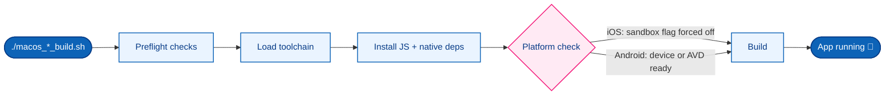

<p align="center">
  <h1 align="center">⚙️ MyHealthHub — Executable Build Scripts</h1>
</p>

<p align="center">
  <strong>One command in, a running app out.</strong><br/>
  Load the toolchain → install deps → pick a target → build → launch.
</p>

<p align="center">
  
  
  
  
  <a href="../LICENSE"></a>
</p>

---

## 📚 Table of Contents

- [📖 Overview](#-overview)
- [🗺️ Build Pipeline](#️-build-pipeline)
- [🍎 macos_iosapp_build.sh](#-macos_iosapp_buildsh)
- [🤖 macos_xdaapp_build.sh](#-macos_xdaapp_buildsh)
- [🩹 Error Message Format](#-error-message-format)
- [⚠️ Compatibility Notes](#️-compatibility-notes)

---

## 📖 Overview

These two scripts build and launch **MyHealthHub** (Android + iOS) end to end —
no manual multi-step setup, no memorizing toolchain paths. They apply to
MyHealthHub only; the DSA Tablet App (`lxc-myrecords-dsa-xda`) has its own
build flow — see that app's README.

| Script | Platform | Default target | Also supports |
|---|---|---|---|
| [`macos_iosapp_build.sh`](#-macos_iosapp_buildsh) | iOS | Simulator — **iPhone 14** | Any installed simulator, or a physical device |
| [`macos_xdaapp_build.sh`](#-macos_xdaapp_buildsh) | Android | Whatever's connected, else auto-boots the **lowest-API AVD** | Multiple connected devices — you pick |

Every failure mode — a missing tool, a missing folder, no device connected —
stops the script immediately with a plain-language explanation *and* the exact
developer fix. See [Error Message Format](#-error-message-format).

---

## 🗺️ Build Pipeline

Both scripts follow the same shape — preflight, toolchain, deps, a
platform-specific readiness check, then build+launch:



The two platform-specific branches are what make each script more than a
thin wrapper — see their sections below for exactly what "sandbox flag" and
"device or AVD ready" mean in practice.

---

## 🍎 `macos_iosapp_build.sh`

```bash
./macos_iosapp_build.sh                        # iOS Simulator, default: iPhone 14
./macos_iosapp_build.sh simulator "iPhone 17"   # a different named simulator
./macos_iosapp_build.sh device                  # physical device, default: "Sage 14Pro"
./macos_iosapp_build.sh device "Some Other iPhone"
```

**What it does, in order:**

1. **Preflight** — confirms Xcode, the toolchain loader scripts, and the
   repo's sibling folders all exist.
2. **Load toolchain** — `frameworks/android/env.sh` (Node) +
   `frameworks/ios/env.sh` (Ruby/CocoaPods), then confirms `node`/`pod`
   actually resolved.
3. **JS deps** — `npm install`, skipped if `node_modules` already exists.
4. **CocoaPods deps** — `pod install`, skipped if `Podfile.lock` and
   `Pods/Manifest.lock` already match.
5. **Sandbox guard** 🩹 — Xcode auto-upgrading `project.pbxproj` sets
   `ENABLE_USER_SCRIPT_SANDBOXING = YES`, which breaks CocoaPods' "[CP] Embed
   Pods Frameworks" script with a sandbox `rsync`/`unlink` denial on
   `hermes.framework`. Detected and forced back to `NO`, every run.
6. **Pick + launch** — lists installed simulators (or visible physical
   devices), lets you pick one, and runs `npx react-native run-ios`. For a
   physical device it also checks a signing team is configured, failing with
   GUI instructions if not (genuinely can't be scripted around).

---

## 🤖 `macos_xdaapp_build.sh`

```bash
./macos_xdaapp_build.sh          # debug build
./macos_xdaapp_build.sh release  # release build (installs, does not auto-launch)
```

**What it does, in order:**

1. **Preflight** — confirms the toolchain loader script and the repo's
   sibling folders exist.
2. **Load toolchain** — `frameworks/android/env.sh` (Node, JDK 17, Android
   SDK, Gradle), then confirms `node`/`java`/`adb` actually resolved.
3. **Pick a target** — uses an already-connected device/emulator if there is
   one (letting you choose if there's more than one). If nothing's connected,
   lists installed AVDs, auto-boots one (lowest API level by default, shown
   as a numbered pick-list), and waits for it to finish booting.
4. **JS deps** — `npm install`, skipped if `node_modules` already exists.
5. **Build** — `assembleDebug` / `assembleRelease` via Gradle. This project
   builds **per-ABI split APKs** (e.g. `MyHealthHub-debug-arm64-v8a.apk`), not
   a single `app-debug.apk` — the script resolves the correct split from the
   target device's actual ABI (`adb shell getprop ro.product.cpu.abi`).
6. **Install + launch** — `adb install -r`, then
   `adb shell am start -n com.lxcmyhealthhub/.MainActivity` for debug builds
   (not `monkey` — its exit code is unreliable and was tripping the script's
   error handling on a *successful* launch).

---

## 🩹 Error Message Format

Every failure — missing tool, missing folder, nothing connected — stops the
script immediately and prints:

```
✗ MISSING/BROKEN: <what>

  In plain terms:  <what this means, no jargon>
  For developers:  <the exact command/fix>
```

The goal: a missing prerequisite should be self-explanatory without needing to
hand the error to anyone (or anything) to interpret.

---

## ⚠️ Compatibility Notes

Both scripts target **bash 3.2** on purpose — that's macOS's actual stock
`/bin/bash`, not whatever newer bash you may have installed separately. Avoid:

| ❌ Don't use | ✅ Use instead |
|---|---|
| `mapfile` / `readarray` | a `while read -r line; do arr+=("$line"); done < <(cmd)` loop |
| `${arr[-1]}` (negative index) | `${arr[$((${#arr[@]}-1))]}` |

Using a bash-4+-only feature fails with a `command not found` error that looks
unrelated to the actual build — that's exactly the bug that was found and
fixed here.
