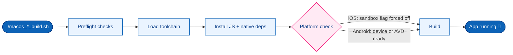

<p align="center">
  <h1 align="center">⚙️ MyHealthHub — Executable Build Scripts</h1>
</p>

<p align="center">
  <strong>One command in, a running app out.</strong><br/>
  Load the toolchain → install deps → pick a target → build → launch.
</p>

<p align="center">
  
  
  
  
  <a href="../LICENSE"></a>
</p>

---

## 📚 Table of Contents

- [📖 Overview](#-overview)
- [🗺️ Build Pipeline](#️-build-pipeline)
- [🍎 macos_iosapp_build.sh](#-macos_iosapp_buildsh)
- [📱 macos_ipadosapp_build.sh](#-macos_ipadosapp_buildsh)
- [📦 macos_ipadosapp_release_build.sh](#-macos_ipadosapp_release_buildsh)
- [🤖 macos_xdaapp_build.sh](#-macos_xdaapp_buildsh)
- [🏁 macos_xdaapp_release_build.sh](#-macos_xdaapp_release_buildsh)
- [📦 macos_healthapi_package.sh](#-macos_healthapi_packagesh)
- [🗂️ macos_apim_run.sh](#️-macos_apim_runsh)
- [🩹 Error Message Format](#-error-message-format)
- [⚠️ Compatibility Notes](#️-compatibility-notes)

---

## 📖 Overview

These two scripts build and launch **MyHealthHub** (Android + iOS) end to end —
no manual multi-step setup, no memorizing toolchain paths. They apply to
MyHealthHub only; the DSA Tablet App (`lxc-myrecords-dsa-xda`) has its own
build flow — see that app's README.

## Current Context

- Weather/API work was merged into `main` on 2026-07-25
- Backend weather code now lives in [`../lxc-databases-apis/lxc-api`](../lxc-databases-apis/lxc-api/)
- Android release builds include a universal APK plus ABI-specific APKs
- Android emulator testing prefers the local `OnePlus_Nord_4_OxygenOS_16_API_36`
  AVD when no physical Android phone is connected. This is an Android 36 Google
  APIs emulator tuned to OnePlus Nord 4-like screen/RAM/storage values; Android
  Emulator does not run the real OnePlus OxygenOS vendor ROM.

| Script | Platform | Default target | Also supports |
|---|---|---|---|
| [`macos_iosapp_build.sh`](#-macos_iosapp_buildsh) | iOS | Simulator — **iPhone 14** | Any installed simulator, or a physical device |
| [`macos_ipadosapp_build.sh`](#-macos_ipadosapp_buildsh) | iPadOS | Simulator — **iPad (A16)** | Any installed iPad simulator, or the connected **Kiara iPad Air 4** |
| [`macos_ipadosapp_release_build.sh`](#-macos_ipadosapp_release_buildsh) | iPadOS release | No device required | Creates an Xcode archive |
| [`macos_xdaapp_build.sh`](#-macos_xdaapp_buildsh) | Android | Whatever's connected, else auto-boots **OnePlus Nord 4 API 36** when available | Multiple connected devices — you pick |
| [`macos_xdaapp_release_build.sh`](#-macos_xdaapp_release_buildsh) | Android release | No device required | Optional clean release build |

Every failure mode — a missing tool, a missing folder, no device connected —
stops the script immediately with a plain-language explanation *and* the exact
developer fix. See [Error Message Format](#-error-message-format).

## 📦 `macos_healthapi_package.sh`

```bash
./macos_healthapi_package.sh
./macos_healthapi_package.sh 2026-07-25-1108
```

**What it does, in order:**

1. Confirms the `lxc-api` folder and required release files exist.
2. Creates `lxc-databases-apis/lxc-api/publish/` if needed.
3. Writes a timestamped `.tar` archive named `lxc-api-YYYY-MM-DD-HHMM.tar`.
4. Includes `package.json`, `package-lock.json`, `tsconfig.json`, `src/`, and `publish/import.env`.
5. Excludes Mac metadata such as `src/.DS_Store`.

Use this when you want a manual Hostinger upload bundle with the exact deploy
contents, kept separate from the working source tree.

Hostinger deployment settings used for this API:

```text
Framework preset: Express
Node version: 20.x
Root directory: ./
Build command: npm run build
Start command: npm start
Domain: apis.lexvoraconsulting.com
```

Environment variables are prepared in:

```text
../lxc-databases-apis/lxc-api/publish/import.env
```

Replace placeholder secret values inside Hostinger, not in git. The deploy
archive belongs under `../lxc-databases-apis/lxc-api/publish/`; do not create or use a
repo-root `publish/` folder.

This script is `lxc-api`-only. `lxc-apim` shares the same MySQL database as
`lxc-api` but is a **separate codebase with its own run/deploy tooling** —
see `macos_apim_run.sh` below. The two are deliberately not merged.

---

## 🗂️ `macos_apim_run.sh`

```bash
./macos_apim_run.sh
```

Interactive menu for running **`lxc-apim`** (the API management/showcase
service — a different codebase from `lxc-api`, sharing only its database).

```text
========================================
 LXC-APIM
========================================
 1) First Time - Default Run/Test Local  (Dev APIM  — Remote DB)
 2) Regular    - Default Run/Test Local  (Dev APIM  — Remote DB)
 3) Custom Run/Test Local  (Dev APIM  — Remote DB)
 4) Make Build to Publish (PROD APIM — local DB)
 q) Quit
========================================
```

**Options 1 and 2 run the identical underlying sequence** — they only differ
in labeling/messaging (option 1 prints a short explainer for newcomers,
option 2 is terser for everyday use). Neither ever asks a question:

1. **Preflight** — confirms the `lxc-apim` folder and the Node toolchain
   loader script exist.
2. **Requires `lxc-apim/.env` to already exist** — if it doesn't, both options
   fail immediately with a message pointing at option 3, rather than
   silently asking questions.
3. **Load toolchain** — `frameworks/android/env.sh` (Node).
4. **Dependencies** — `npm install`, skipped if `node_modules` already exists.
5. **Database** — runs `npm run db:migrate`, `npm run db:seed`, then
   `npm run db:seed:admin` every time. All three are idempotent (migrations
   track what's applied in `apim_schema_migrations`; seed/seed-admin are
   create-once/`ON DUPLICATE KEY UPDATE`), so this doubles as "is everything
   actually in place" — it fixes gaps instead of just detecting them, at
   negligible cost on repeat runs. Prints a `✓` line per sub-step (schema,
   baseline data, admin account).
6. **`lxc-api`, best-effort** — also starts `lxc-api` in the background so
   the catalog's `localhost:3000` link is actually live, not just a label.
   Skipped cleanly with a message (not a failure) if `lxc-api/.env` isn't set
   up yet — that needs a real WeatherAPI.com key, a separate secret this
   script doesn't manage.
7. **Server + explicit health check** — starts `npm run dev` for `lxc-apim`
   in the background (connected to the **real** remote Hostinger database,
   not a local one), polls `http://localhost:3100/v1/health` and prints a
   clear `✓ Health check passed` / `✗ Health check failed` line, then prints
   `✓ All set` and opens the browser only once that check passes. Ctrl+C
   stops **both** servers (`lxc-apim` and, if started, `lxc-api`) and
   returns to this menu.

**Option 3 — Custom Run/Test Local (Dev APIM — Remote DB):** the interactive
path. Prompts for the MySQL user (defaulting to whatever's already saved, or
the known Hostinger admin user) and the real MySQL password (hidden input,
never echoed or hardcoded anywhere in this script), generates a random dev
`JWT_SECRET`, and writes/overwrites `lxc-apim/.env` (including
`APIM_ENV=local`). Then runs the same database + `lxc-api` + server +
health-check sequence as options 1/2.

**Option 4 — Make Build to Publish (PROD APIM — local DB):** not built yet.
Selecting it just re-shows the menu; this will later become `lxc-apim`'s own
packaging flow (analogous to `macos_healthapi_package.sh`, but its own
separate script/file, not a shared one).

Run this script yourself in a terminal rather than asking an AI assistant to
run it on your behalf — the MySQL password prompt (option 3) is interactive
and should never pass through anything else.

---

## 🗺️ Build Pipeline

Both scripts follow the same shape — preflight, toolchain, deps, a
platform-specific readiness check, then build+launch:


```mermaid
flowchart LR
    A(["./macos_*_build.sh"]) --> B[Preflight checks]
    B --> C[Load toolchain]
    C --> D[Install JS + native deps]
    D --> E{Platform check}
    E -->|iOS: sandbox flag forced off| F[Build]
    E -->|Android: device or AVD ready| F
    F --> G(["App running 🚀"])

    classDef step fill:#EAF4FF,stroke:#0D63B7,color:#073B86,stroke-width:1.5px
    classDef decision fill:#FFEAF4,stroke:#F41678,color:#073B86,stroke-width:1.5px
    classDef terminal fill:#0D63B7,stroke:#073B86,color:#ffffff,stroke-width:1.5px
    class B,C,D,F step
    class E decision
    class A,G terminal
```

The two platform-specific branches are what make each script more than a
thin wrapper — see their sections below for exactly what "sandbox flag" and
"device or AVD ready" mean in practice.

---

## 📱 `macos_ipadosapp_build.sh`

```bash
./macos_ipadosapp_build.sh
```

Builds the iPad-only native wrapper in `lxc-myhealthhub-iPadOS` while reusing
the shared React Native source in `lxc-myhealthhub-shared`. The default
selection is the `iPad (A16)` simulator; menu option `1` installs on a
connected iPad, including `Kiara iPad Air 4` running iPadOS 26.5.

## 📦 `macos_ipadosapp_release_build.sh`

```bash
./macos_ipadosapp_release_build.sh
```

Creates a Release archive at
`lxc-myhealthhub-iPadOS/build/archive/LxcMyHealthHubiPadOS.xcarchive`.
Configure Apple signing in Xcode before distributing the archive.

## 🍎 `macos_iosapp_build.sh`

```bash
./macos_iosapp_build.sh                        # iOS Simulator, default: iPhone 14
./macos_iosapp_build.sh simulator "iPhone 17"   # a different named simulator
./macos_iosapp_build.sh device                  # physical device, default: "Sage 14Pro"
./macos_iosapp_build.sh device "Some Other iPhone"
```

**What it does, in order:**

1. **Preflight** — confirms Xcode, the toolchain loader scripts, and the
   repo's sibling folders all exist.
2. **Load toolchain** — `frameworks/android/env.sh` (Node) +
   `frameworks/ios/env.sh` (Ruby/CocoaPods), then confirms `node`/`pod`
   actually resolved.
3. **JS deps** — `npm install`, skipped if `node_modules` already exists.
4. **CocoaPods deps** — `pod install`, skipped if `Podfile.lock` and
   `Pods/Manifest.lock` already match.
5. **Sandbox guard** 🩹 — Xcode auto-upgrading `project.pbxproj` sets
   `ENABLE_USER_SCRIPT_SANDBOXING = YES`, which breaks CocoaPods' "[CP] Embed
   Pods Frameworks" script with a sandbox `rsync`/`unlink` denial on
   `hermes.framework`. Detected and forced back to `NO`, every run.
6. **Pick + launch** — lists installed simulators (or visible physical
   devices), lets you pick one, and runs `npx react-native run-ios`. For a
   physical device it also checks a signing team is configured, failing with
   GUI instructions if not (genuinely can't be scripted around).

---

## 🤖 `macos_xdaapp_build.sh`

```bash
./macos_xdaapp_build.sh               # debug build
./macos_xdaapp_build.sh release       # release build, installs, does not auto-launch
./macos_xdaapp_build.sh release-only  # release build only, no device required
./macos_xdaapp_build.sh release-clean # clean release build only, no device required
```

**What it does, in order:**

1. **Preflight** — confirms the toolchain loader script and the repo's
   sibling folders exist.
2. **Load toolchain** — `frameworks/android/env.sh` (Node, JDK 17, Android
   SDK, Gradle), then confirms `node`/`java`/`adb` actually resolved.
3. **Pick a target** — uses an already-connected device/emulator if there is
   one (letting you choose if there's more than one). If nothing's connected,
   lists installed AVDs, auto-boots one (lowest API level by default, shown
   as a numbered pick-list), and waits for it to finish booting. If
   `OnePlus_Nord_4_OxygenOS_16_API_36` exists, it is preferred as the default
   MyHealthHub phone test emulator. If not, `OPPO_Reno_10_5G_API_35` is the
   fallback preferred test emulator. Skipped for `release-only` and
   `release-clean`.
4. **JS deps** — `npm install`, skipped if `node_modules` already exists.
5. **Build** — `assembleDebug` / `assembleRelease` via Gradle. This project
   builds **per-ABI split APKs** (e.g. `MyHealthHub-debug-arm64-v8a.apk`), not
   a single `app-debug.apk` — the script resolves the correct split from the
   target device's actual ABI (`adb shell getprop ro.product.cpu.abi`).
6. **Install + launch** — `adb install -r`, then
   `adb shell am start -n com.lxcmyhealthhub/.MainActivity` for debug builds
   (not `monkey` — its exit code is unreliable and was tripping the script's
   error handling on a *successful* launch).

For release APK generation without needing any Android device connected, the
`release-only` and `release-clean` modes delegate to
[`macos_xdaapp_release_build.sh`](#-macos_xdaapp_release_buildsh).

---

## 🏁 `macos_xdaapp_release_build.sh`

```bash
./macos_xdaapp_release_build.sh
./macos_xdaapp_release_build.sh clean
```

**What it does, in order:**

1. **Preflight** — confirms the Android toolchain loader, shared React Native
   folder, and Android native project exist.
2. **Load toolchain** — sources `frameworks/android/env.sh`, then checks
   `node` and `java`.
3. **JS deps** — runs `npm install` only if `node_modules` is missing.
4. **Release build** — runs `./gradlew assembleRelease` in
   `lxc-myhealthhub-xda`. Pass `clean` or `--clean` to run `./gradlew clean`
   before building.
5. **Artifact report** — prints the generated release files from:

```text
../lxc-myhealthhub-xda/app/build/outputs/apk/release/
```

Use this when you only need fresh release APKs and do not want the script to
find, boot, install to, or launch on an Android device.

---

## 🩹 Error Message Format

Every failure — missing tool, missing folder, nothing connected — stops the
script immediately and prints:

```
✗ MISSING/BROKEN: <what>

  In plain terms:  <what this means, no jargon>
  For developers:  <the exact command/fix>
```

The goal: a missing prerequisite should be self-explanatory without needing to
hand the error to anyone (or anything) to interpret.

---

## ⚠️ Compatibility Notes

Both scripts target **bash 3.2** on purpose — that's macOS's actual stock
`/bin/bash`, not whatever newer bash you may have installed separately. Avoid:

| ❌ Don't use | ✅ Use instead |
|---|---|
| `mapfile` / `readarray` | a `while read -r line; do arr+=("$line"); done < <(cmd)` loop |
| `${arr[-1]}` (negative index) | `${arr[$((${#arr[@]}-1))]}` |

Using a bash-4+-only feature fails with a `command not found` error that looks
unrelated to the actual build — that's exactly the bug that was found and
fixed here.
