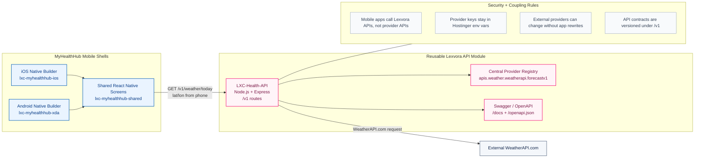

<h1 align="center">🩺 MyRecords Healthcare Platform</h1>

<p align="center">
  <a href="https://lexvoraconsulting.com" target="_blank"><strong>lexvoraconsulting.com</strong></a>
</p>

<p align="center">
    
    
    
    
</p>

---

## 📚 Table of Contents

- [📖 Overview](#-overview)
- [📱 The Applications](#-the-applications)
- [🎯 Platform & Device Targets](#-platform--device-targets)
- [👩‍💻 Developer's Guide](#-developers-guide)
- [🚀 Setup and Running the Apps](#-setup-and-running-the-apps)
- [⚡️ Common Commands](#️-common-commands)
- [🛠️ Local macOS Development Setup](#-local-macos-development-setup)
- [📜 Repository History](#-repository-history)
- [🤖 AI Assistant Guide](#-ai-assistant-guide)
- [© License](#-license)

---

## 📖 Overview

This repository is the home of the **Lexvora MyRecords healthcare platform**.
It contains two independently built React Native applications:

1. **MyHealthHub**: a patient-facing mobile app for managing health records.
2. **DSA Tablet App**: an offline-first tablet app for field agents.

> **Note**: The two apps do not share code or dependencies. They are versioned
> and built separately inside the same monorepo.

## Current Context

**Weather integration status**

- Main branch contains the Hostinger weather integration as of 2026-07-25
- Reusable backend module: [`lxc-health-api`](./lxc-health-api/)
- `LXC-Health-API` is not only a MyHealthHub helper. It is a shared Lexvora API
  module that any Lexvora app can consume, and it is eligible to become its own
  repository or package later.
- MyHealthHub calls `LXC-Health-API` first, and `LXC-Health-API` calls
  WeatherAPI.com internally.
- Production WeatherAPI secrets belong in Hostinger environment variables, not in app source
- Temporary dev fallback support exists in the mobile app so the home temperature can still render during backend setup
- Weather uses phone latitude/longitude when available and falls back to Dubai
- Current production API deployment target shown in Hostinger: `https://apis.lexvoraconsulting.com`

## 📱 The Applications

| App | Who it's for | Platforms | Folder(s) |
|---|---|---|---|
| **MyHealthHub** | Patients | Android, iOS | [`lxc-myhealthhub-shared`](./lxc-myhealthhub-shared/), [`lxc-myhealthhub-xda`](./lxc-myhealthhub-xda/), [`lxc-myhealthhub-ios`](./lxc-myhealthhub-ios/) |
| **DSA Tablet App** | Field agents (Direct Sales Agents) | Android tablet | `lxc-myrecords-dsa-xda` |

---

### 1. 🏥 MyHealthHub Mobile App

The MyHealthHub app is a modern, patient-centric mobile application that helps
patients manage health information, connect with providers, and stay informed
about their care.

**Key Features:**
- 🗂️ View and manage health records, prescriptions, and vitals
- 📅 Schedule and track appointments, with a dedicated schedule-visit flow
- 👨‍👩‍👧 Family Health Space — family member cards, add-member action, family health score
- ⚡ Quick actions: Health Records, Reports & Visits, Find Nearby Care, Appointments,
  Health App Sync, Family Profiles
- 📅 Upcoming Appointments card with collapsible top-3 preview, split detail rows,
  and doctor-gender icons
- 🧪 Lab Reports & Results card with tabbed Medication / Laboratory / Radiology views
- 📂 Document Vault card with secure uploads and top-5 preview when expanded
- 📞 One-call support card (India head office line)
- 🧑‍⚕️ DSA Assisted Setup card — bridges to in-person agent support
- 🔒 Privacy/security card
- 👤 Profile and settings management
- 🌤️ Weather integration through `/v1/weather/today`; city and Celsius temperature render below the top glass header, outside the header slab, in ruby pink

> **Status**: Android build verified (debug APK builds successfully). iOS build
> verified end-to-end and launches on both the iOS Simulator and a physical
> device.
>
> **Important iOS note**: when opening the native iOS project in Xcode, use
> `LxcMyHealthHub.xcworkspace` and not `LxcMyHealthHub.xcodeproj`. The
> workspace is the correct entry point because CocoaPods-generated targets and
> framework links live there.

> For detailed setup and development instructions, see the app's dedicated README:
> **➡️ `lxc-myhealthhub-shared/README.md`**

---

### 2. 🚐 MyRecords DSA Tablet App

The DSA (Direct Sales Agent) app is a robust, offline-first tablet application for
field agents. It lets agents manage patient and doctor information, book appointments,
and upload documents — even with zero internet connectivity.

### Features

- 🔐 PIN-based authentication (4-6 digit, device-locked)
- 🩺 Doctor management — specialization, schedule, patient assignment
- 📅 Appointments — booking, status tracking, consultation types
- 📎 Document uploads — camera, file picker, document scanner
- 📍 Geo-tracking — GPS tracking, visit logging linked to patients/doctors
- 📋 Medical records — diagnosis, treatment, prescriptions, follow-ups
- 🌐 English + Hindi UI (switchable)
- 💾 **100% offline** — local SQLite storage, sync-ready (`sync_status` column) for
  when a backend is live

> For detailed setup and development instructions, see the app's dedicated README:
> **➡️ `lxc-myrecords-dsa-xda/README.md`**

---

## 🎯 Platform & Device Compatibility

This section explains which devices and operating systems are supported by each
application in easy-to-understand terms.

| Component | Target | Supported / Recommended | Notes |
|---|---|---|---|
| `LXC-Health-API` backend module | Node.js | Recommended: Node.js `20.x` | Hostinger showed support for `18.x`, `20.x`, `22.x`, and `24.x`. Deploy the packaged archive from `lxc-health-api/publish/`. This module is designed so it can later move into its own repo/package. |
| MyHealthHub app | Android smartphones | Android `10+` | Best fit for modern phones released from late 2019 onward, including Galaxy S10+, Pixel 4+, and OnePlus 7+. |
| MyHealthHub app | iPhone | iOS `15.1+` | Works on iPhone 6s and newer, including SE, 7, 8, X, 11, 12, 13, 14, 15, and Plus/Pro/Max variants. |
| DSA Tablet App | Android tablets | Modern Android tablet devices | Built for Android tablets only. Not intended for phones or iPads. |
| Weather API contract | Mobile weather flow | Phone lat/lon preferred | If location is unavailable, the weather backend falls back to Dubai. |

---

## 🧱 Architecture

The platform is intentionally split into independent layers. The mobile apps
own the user experience, `LXC-Health-API` owns healthcare-facing backend
contracts, and external providers stay behind the backend boundary. This makes
the system secure, reusable, and loosely coupled.

`LXC-Health-API` is a separate module inside this monorepo today, but it should
be treated as a product-grade service boundary. Any Lexvora app can call it in
the future, and the folder is eligible to be extracted into its own repository
or published package when the platform grows.



### Mobile Layer

MyHealthHub is split into three folders so native build concerns and shared app
logic stay clean:

| Layer | Folder | Responsibility |
|---|---|---|
| iOS native shell | [`lxc-myhealthhub-ios`](./lxc-myhealthhub-ios/) | Xcode project, CocoaPods, iOS build and signing setup |
| Android native shell | [`lxc-myhealthhub-xda`](./lxc-myhealthhub-xda/) | Gradle project, Android manifest, APK/AAB build setup |
| Shared app source | [`lxc-myhealthhub-shared`](./lxc-myhealthhub-shared/) | Screens, navigation, assets, theme, API callers, React Native app logic |

Both iOS and Android render the same shared screens. That means a screen change,
theme token update, or API call flow usually happens once in
`lxc-myhealthhub-shared` and is then built by both native shells.

### API Layer

`LXC-Health-API` lives in [`lxc-health-api`](./lxc-health-api/) and is the
backend contract layer for health-related API capabilities. It is currently
deployed as a Hostinger Node.js app, but it is designed as a reusable Lexvora
service module.

| API Capability | Current Status | Notes |
|---|---|---|
| Runtime | Node.js + Express | Recommended Hostinger runtime: Node.js `20.x` |
| Versioning | `/v1/...` | Keeps mobile contracts stable as new versions are introduced |
| Documentation | Swagger at `/docs` | Raw OpenAPI available at `/openapi.json` |
| Health check | `GET /v1/health` | Confirms the service is alive |
| Weather | `GET /v1/weather/today` | Accepts `lat`/`lon` or `q`; falls back to Dubai |
| Provider registry | `apis.weather.weatherapi.forecastv1` | Keeps external provider URLs and keys in one common place |

### External Provider Boundary

The mobile apps do not need to know WeatherAPI.com URLs, query rules, or secret
keys. They only call Lexvora-owned endpoints. `LXC-Health-API` then talks to
the external provider internally.

This gives the platform several advantages:

- **Security**: provider API keys stay in Hostinger environment variables.
- **Loose coupling**: mobile apps are not tied to WeatherAPI.com directly.
- **Provider flexibility**: WeatherAPI.com can be replaced or supplemented later
  without changing every mobile app screen.
- **Shared reuse**: other Lexvora apps can use the same weather endpoint without
  copying provider logic.
- **Version safety**: `/v1` contracts can keep working while `/v2` evolves.
- **Testing clarity**: Swagger lets the backend be tested online before mobile
  apps depend on it.

### Request Flow

Current weather flow:

1. The phone provides latitude and longitude when available.
2. `lxc-myhealthhub-shared/src/api/weather.ts` calls
   `GET /v1/weather/today?lat=<lat>&lon=<lon>`.
3. `LXC-Health-API` reads the WeatherAPI.com provider config from the central
   API registry.
4. `LXC-Health-API` calls WeatherAPI.com using server-side credentials.
5. The backend normalizes the provider response into an app-friendly JSON shape.
6. MyHealthHub renders the city and Celsius temperature on the home screen.

If phone location or provider lookup fails, the backend falls back to Dubai so
the app can still show a predictable weather result.

### Future Extraction Path

`LXC-Health-API` is intentionally kept in its own folder with its own
`package.json`, `tsconfig.json`, README, env contract, Swagger config, routes,
services, and publish workflow. That makes future extraction straightforward:

| Future Step | Why It Is Possible |
|---|---|
| Move to a separate repository | The module already has its own source, package metadata, docs, and deployment bundle |
| Publish as an internal package | API registry, service modules, and typed contracts can be packaged independently |
| Serve multiple Lexvora apps | The API contract is app-agnostic and versioned under `/v1` |
| Add more providers | External APIs are hidden behind backend services and central config |
| Add auth and rate limits | Mobile callers already route through one backend boundary |

---

## �‍💻 Developer's Guide

This section provides a deeper look into the architecture and technology choices for developers working on the codebase.

### Core Philosophy
The repository is a monorepo of two separate applications. A change in one app
does not affect the other. That allows each app to keep its own technology and
release decisions.

### MyHealthHub Architecture
- **Structure**: The app is split into three folders to cleanly separate the shared JavaScript/TypeScript code from the native Android and iOS build projects.
  - `lxc-myhealthhub-shared`: Contains all app logic, screens, components, and assets. **99% of development happens here.**
  - `lxc-myhealthhub-xda`: The native Android project (Gradle).
  - `lxc-myhealthhub-ios`: The native iOS project (Xcode/CocoaPods).
- **Technology**: Built with modern tools including **TypeScript**, **React
  Navigation 7**, and **TanStack Query** for asynchronous state management. It
  uses a mock service for now, but is architected for a seamless transition to
  a live backend.
- **Current UI pattern**: The MyHealthHub home dashboard now uses rounded badge
  icons, collapsible cards, tabbed lab results, and a document vault section.
  The bottom navigation uses a five-tab layout with `Home`, `Health`,
  `Schedules`, `Vault`, and `Reports`, with pink icons by default and blue
  icons for the active tab.
- **Weather/API pattern**: `lxc-myhealthhub-shared/src/api/weather.ts` reads
  phone lat/lon and calls `WEATHER_API_BASE_URL/v1/weather/today` through the
  shared API config. If device location or backend access fails in dev, it can
  temporarily fall back to WeatherAPI.com using `WEATHER_PROVIDER_DEV_KEY`.
- **Home hero pattern**: The brand row stays in the top glass header. Weather
  city/temp stays outside that header. The greeting copy sits in a separate
  glass slab with only top corners rounded from `radii.card`; the slab grows
  behind the Family Health Space card without shifting the card.
- **iOS native setup**: the iPhone build path was verified on a physical device after fixing the CocoaPods/Xcode integration for the monorepo layout. The iOS project resolves the shared JS source from `../lxc-myhealthhub-shared`, and the workspace is the file to open in Xcode.

### DSA Tablet App Architecture
- **Structure**: This app is self-contained within the `lxc-myrecords-dsa-xda` folder.
- **Technology**: Built with **JavaScript** and designed to be **100% offline-first**. All data is stored and managed in a local **SQLite** database. It features a `sync_status` column in its tables, preparing it for future backend synchronization without requiring a constant internet connection.

### Tech Stack Comparison

| | MyHealthHub | DSA Tablet App |
|---|---|---|
| **Language** | TypeScript | JavaScript |
| **React** | 19.0.0 | 18.3.1 |
| **React Native** | 0.78.3 | 0.75.4 |
| **Navigation** | React Navigation 7 (bottom tabs) | React Navigation 6 (bottom tabs + native stack) |
| **Data fetching** | TanStack Query 5 + Axios | — (local-only, no backend calls yet) |
| **Local storage** | AsyncStorage 2, `react-native-keychain` (installed, not yet wired up) | SQLite (`react-native-sqlite-storage`) + AsyncStorage |
| **Validation** | `zod` (installed, not yet wired up) | — |
| **State management** | `zustand` (installed, not yet wired up) | React local state |
| **i18n** | `i18n-js` (installed, not yet wired up) | `i18n-js` — English + Hindi, active |
| **Env config** | `react-native-config` | — |
| **Bundler** | Metro | Metro (native) + Webpack via `@expo/webpack-config` (web preview) |
| **Testing** | Jest configured (no test files written yet) | — |
| **Linting** | ESLint (`@react-native/eslint-config`) | ESLint (`@react-native/eslint-config`) |
| **Node engine** | `>=18` | `>=18` |

---

## 🚀 Setup and Running the Apps

Follow these steps to get a local development environment running.

### Step 1: Set Up The Local Toolchain (CRITICAL)

This project uses a sandboxed, version-pinned toolchain for macOS instead of relying on globally installed tools. Before doing anything else, you **must** load this environment. See the Local macOS Development Setup section for details.

In your terminal, run:
```sh
source "/Users/SageVish/Documents/Development Work/frameworks/android/env.sh"
```

### Step 2: Clone the Repository

```sh
git clone <repository-url>
cd lxc-myrecords
```

### Step 3: Install Dependencies and Run an App

Choose which app you want to work on and run the commands from within its directory.

#### To run the MyHealthHub App:
```sh
cd lxc-myhealthhub-shared
npm install
npm run android # Or npm run ios
```

#### To run the DSA Tablet App:
```sh
cd lxc-myrecords-dsa-xda
npm install
npm run android
```

### Fastest path: one-shot build scripts

For MyHealthHub specifically, `Executable/` at the repo root has scripts that do
everything above in one command — load the toolchain, install deps, build, and
launch — with clear error messages if a prerequisite (Xcode, a device, a folder)
is missing:

```sh
./Executable/macos_iosapp_build.sh          # iOS Simulator/device
./Executable/macos_xdaapp_build.sh          # Android debug/release build
```

## ⚡️ Common Commands

All commands should be run from within the specific app's directory (`lxc-myhealthhub-shared` or `lxc-myrecords-dsa-xda`).

| Command | MyHealthHub (`lxc-myhealthhub-shared`) | DSA Tablet App (`lxc-myrecords-dsa-xda`) |
|---|---|---|
| **Install Dependencies** | `npm install` | `npm install` |
| **Start Metro Bundler** | `npm run start` | `npm run start` |
| **Run on Android** | `npm run android` | `npm run android` |
| **Run on iOS** | `npm run ios` | `npm run ios` (not used) |
| **Lint Code** | `npm run lint` | `npm run lint` |
| **Build Debug APK** | `npm run build:android:debug` | `cd android && ./gradlew assembleDebug` |

### Hostinger API Deployment Bundle

The Node backend is packaged from `lxc-health-api/` using:

```sh
./Executable/macos_healthapi_package.sh
```

The script writes deployable archives to:

```text
lxc-health-api/publish/
```

Use the `.tar` file for manual Hostinger upload. The accidental root-level
`publish/` folder is not used and should not exist.

## 🛠️ Local macOS Development Setup

> **Important**: This repository uses a sandboxed, project-independent toolchain instead of relying on globally installed packages like Node or Java.

Development on this repo has been done on macOS using a local, project-independent
toolchain kept outside the repo under a shared `frameworks/` folder, rather than relying
on global/system installs of Node, Java, or the Android SDK:

```text
frameworks/
├── android/          # Android SDK, platform tools, emulator tools
├── android-emulator/ # Dedicated emulator installer and AVD files
├── ios/              # Ruby + CocoaPods (needed for iOS builds)
├── jdk/              # JDK 17
├── node/             # Node.js and npm
└── gradle/           # Gradle
```

Before working on either app, the toolchain is loaded into the shell with:

```sh
source "/Users/SageVish/Documents/Development Work/frameworks/android/env.sh"  # Node, Java, Android SDK, Gradle
source "/Users/SageVish/Documents/Development Work/frameworks/ios/env.sh"      # Ruby + CocoaPods — iOS builds only
```

This keeps Node, Java, the Android SDK, and Gradle versions consistent and isolated per
machine, without changing global package-manager state. See
[`lxc-myhealthhub-shared/README.md`](./lxc-myhealthhub-shared/README.md) for the exact
verified tool versions.

## 📜 Project History
- **Initial build-out** — MyHealthHub (patient-facing, Android-first) and the DSA
  tablet app (field-agent, offline-first with SQLite) were developed as two separate
  React Native apps under this repo.
- **2024-07-21 — MyHealthHub split into shared/platform folders.** The single
  `lxc-myhealthhub-mobile` app was split into `lxc-myhealthhub-shared` (JS/TS source,
  the common area) plus `lxc-myhealthhub-xda` (Android builder) and
  `lxc-myhealthhub-ios` (iOS builder), so the native Android/iOS build projects are
  clearly separated from the app code they both build. React Native's own file-suffix
  convention (`Thing.ios.tsx` / `Thing.android.tsx`) is still the mechanism for any
  platform-specific code.
- **2024-07-21 — DSA app renamed.** `lxc-myrecords-dsaapp-xda` was renamed to
  `lxc-myrecords-dsa-xda` for naming consistency with the rest of the repo.
- **2026-07-25 — Hostinger weather API integration.** Added `lxc-health-api`,
  Swagger/OpenAPI docs, `/v1/health`, `/v1/weather/today`, centralized provider
  config, Hostinger packaging, and MyHealthHub home weather UI using device
  lat/lon with Dubai fallback.

## 🤖 AI Assistant Guide

This repository includes a `CLAUDE.md` file containing detailed context for AI coding assistants. It covers the repository layout, the unique macOS toolchain setup, and architectural conventions. To ensure the best results when using an AI assistant, please provide it with the contents of this file.

---

## © License

This project is the intellectual property of **Lexvora Consulting**. All rights
reserved. © 2024–2026 Lexvora Consulting. See [`LICENSE`](./LICENSE) for the
full terms — the native builders each carry their own copy
([`lxc-myhealthhub-ios/LICENSE`](./lxc-myhealthhub-ios/LICENSE),
[`lxc-myhealthhub-xda/LICENSE`](./lxc-myhealthhub-xda/LICENSE)). For more
information, visit [lexvoraconsulting.com](https://lexvoraconsulting.com).
