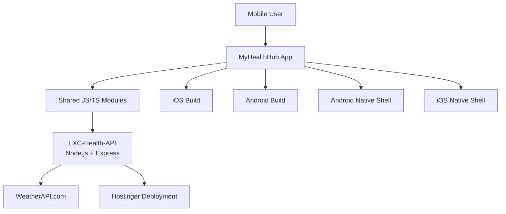

# <p align="center">LXC Documentation Hub</p>

<p align="center">
  <strong>Lexvora's central documentation home for MyHealthHub, LXC-Health-API, shared app
  modules, deployment notes, and release standards.</strong>
</p>

<p align="center">
  <a href="#overview"><strong>Overview</strong></a> ·
  <a href="#documentation-map"><strong>Documentation Map</strong></a> ·
  <a href="#architecture"><strong>Architecture</strong></a> ·
  <a href="#platform--device-compatibility"><strong>Platform & Device Compatibility</strong></a> ·
  <a href="#release-and-deployment"><strong>Release & Deployment</strong></a> ·
  <a href="#writing-standards"><strong>Writing Standards</strong></a>
</p>

<p align="center">
  
  
  
  
</p>

---

## Overview

`lxc-documentation` is the curated documentation hub for the Lexvora/MyHealthHub ecosystem.
It exists to keep product, engineering, API, release, and deployment knowledge in one place
so the app, backend, and operational notes remain aligned.

This repo should be treated as the readable source of truth for:

1. Product and engineering context
2. Shared architecture decisions
3. Mobile app implementation notes
4. Backend API conventions
5. Hostinger deployment guidance
6. Release and packaging standards
7. Platform compatibility references

The goal is simple:

> one place to understand the system, how it is wired, and how it should evolve.

---

## Documentation Map

| Area | Purpose | Typical Files |
|---|---|---|
| Product Overview | Explains what the ecosystem is and why it exists | `README.md`, `overview.md` |
| Mobile App | Screens, UI patterns, shared code, and release behavior | `myhealthhub-mobile.md`, `screens.md` |
| Backend API | Node.js service, weather proxy, Swagger, env vars | `lxc-api.md`, `api-contract.md` |
| Architecture | Shared modules, separation of concerns, data flow | `architecture.md`, `system-design.md` |
| Deployment | Hostinger, build artifacts, release flow, env setup | `deployment.md`, `release-runbook.md` |
| Standards | Coding, naming, docs, and file organization | `coding-standards.md`, `writing-standards.md` |
| Compatibility | Supported devices, OS versions, emulator targets | `compatibility.md` |

---

## Architecture



### Design Principles

- Shared UI and feature logic should live in reusable modules.
- Screens may differ visually, but common shell patterns should not be duplicated.
- External provider secrets must stay server-side whenever possible.
- The mobile app should talk to the backend API, not directly to third-party providers.
- Documentation should explain the "why" as clearly as the "what."

---

## Platform & Device Compatibility

### Mobile App Targets

| Platform | Supported / Targeted Versions | Notes |
|---|---|---|
| iOS | iOS 15 and newer | Primary visual polish target, including Dynamic Island devices |
| Android | Android 10 and newer | Supports modern OEM skins and device variants |
| React Native | 0.75+ / 0.78+ depending on subproject | Check the subproject README for exact versions |
| TypeScript | 5.x | Shared source throughout the app stack |
| Node.js API | 20.x LTS | Recommended for Hostinger Node deployment |

### Device Layout Targets

| Device Class | Notes |
|---|---|
| iPhone Pro / Dynamic Island devices | Verify safe-area, top banner bleed, and glass header spacing |
| Android flagship devices | Verify top inset handling and card elevation behavior |
| Mid-range Android phones | Verify scrolling performance and readable typography |
| Tablet layouts | Not a primary target yet, but docs should stay responsive-friendly |

### Emulator Guidance

| Platform | Recommended Test Profile |
|---|---|
| iOS Simulator | Current iPhone Pro model with Dynamic Island |
| Android Emulator | Pixel-class device with modern API level |
| OEM Skin Checks | OnePlus / OPPO-style devices for real-world spacing and icon rendering |

---

## Repository Layout

```text
lxc-documentation/
├── README.md
├── architecture.md
├── compatibility.md
├── deployment.md
├── release-runbook.md
├── api-contract.md
├── coding-standards.md
└── writing-standards.md
```

This file is the landing page. The remaining files can expand each topic without
making the top-level README bulky.

---

## API & Integration Model

The current backend approach is intentionally layered:

1. Mobile app requests weather or health data from the internal API.
2. `LXC-Health-API` performs the external provider call.
3. Secrets, provider keys, and routing details remain on the server.
4. The app receives a normalized payload shaped for the UI.

### Example provider registry pattern

```text
apis.weather.weatherapi.forecastv1
```

This pattern keeps provider URLs and tokens centralized instead of scattering them
across screens or services.

---

## Release and Deployment

### Mobile

- Keep release builds reproducible.
- Separate dev, staging, and release artifacts.
- Store release notes alongside the build guidance.
- Document any manual steps needed for Android or iOS packaging.

### Backend

- Deploy Node.js services only to environments that explicitly support Node.
- Keep Hostinger environment variables documented but never committed with real secrets.
- Document Swagger URLs, health endpoints, and fallback behavior.

### Suggested documentation topics

| Topic | Why it matters |
|---|---|
| Build packaging | Ensures every release can be reproduced |
| Hostinger env vars | Keeps deployment predictable |
| Swagger URLs | Makes testing and debugging easy |
| Fallback behavior | Prevents production regressions |
| Secret handling | Reduces risk of accidental exposure |

---

## Writing Standards

To keep the docs premium and easy to maintain:

1. Use clear section headers and short paragraphs.
2. Prefer tables for versions, compatibility, and release steps.
3. Explain architecture with diagrams when possible.
4. Document defaults, fallbacks, and edge cases.
5. Keep secrets out of examples.
6. Separate product-facing language from implementation detail where helpful.
7. Link to source files when they are the true source of truth.

### Tone

- Calm
- Precise
- Reusable
- Engineer-friendly
- Product-aware

---

## Recommended Next Docs

If you want this hub to become the main entry point for the repo, the next files to add should be:

- [architecture.md](./architecture.md)
- [compatibility.md](./compatibility.md)
- [deployment.md](./deployment.md)
- [release-runbook.md](./release-runbook.md)
- [api-contract.md](./api-contract.md)
- [coding-standards.md](./coding-standards.md)
- [writing-standards.md](./writing-standards.md)

---

## Footer

Made with care for Lexvora Consulting and the MyHealthHub ecosystem.

Last updated: 2026-07-26
