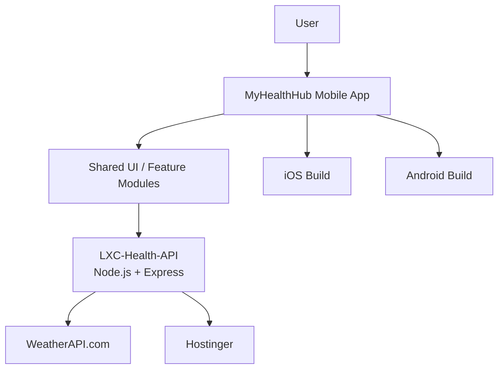

# Architecture

This document explains how the Lexvora/MyHealthHub ecosystem is structured and
how the major parts are meant to interact.

## System Overview

The system is intentionally split into layers so each part has a clear job:

1. The mobile app renders screens and collects user interaction.
2. Shared JS/TS modules provide reusable UI, helpers, themes, and feature logic.
3. `LXC-Health-API` acts as the private server-side gateway.
4. External provider services are called from the backend, not directly from the app.
5. Hostinger is the current deployment target for the backend API.

## High-Level Flow

## Shared App Boundary

The app is designed so common behavior can be reused without duplicating the
same JSX, styles, or provider wiring across screens.

Examples of shared concerns:

- Theme tokens
- Reusable top screen chrome
- API clients
- Weather and device-location helpers
- Feature-level data mappers
- Navigation and screen utilities

This keeps screen files focused on what is unique to that surface.

## Separation Of Concerns

### Mobile App

The mobile app should:

- Render UI
- Capture user input
- Request data from the backend API
- Stay responsive to screen size and platform differences

The mobile app should not:

- Store provider secrets
- Talk directly to external third-party providers when a backend exists
- Duplicate shared layout code in every screen file

### Backend API

`LXC-Health-API` should:

- Hold provider keys and tokens
- Normalize provider responses
- Expose stable, app-friendly endpoints
- Handle fallback logic such as defaulting to Dubai when lookup fails
- Provide Swagger/OpenAPI documentation for testing and visibility

### External Providers

External providers should be treated as implementation details of the backend.
The app should rely on the backend contract, not on provider-specific payloads.

## Screen Strategy

There are two broad screen patterns in the current app:

1. `HomeScreen` can stay visually bespoke because it is the flagship dashboard.
2. Other screens should use shared top-shell pieces for the repeated banner/header
   pattern.

This means the app can preserve premium visual design while still remaining
maintainable.

## Data Flow Example

Weather request flow:

1. The device obtains location if possible.
2. The mobile app calls the backend weather endpoint.
3. The backend calls WeatherAPI.com.
4. The backend normalizes the response.
5. The app renders the normalized `city` and `tempC` data.

## Folder Intent

Recommended roles:

| Folder / Module | Purpose |
|---|---|
| `src/components` | Shared UI building blocks |
| `src/features` | Feature-specific logic and local components |
| `src/theme` | Colors, spacing, radii, typography, common design tokens |
| `src/api` | API clients and provider configuration |
| `assets` | Images, icons, and visual resources |

## Architectural Rules

- Reuse common screen chrome where possible.
- Keep screens thin and feature-driven.
- Keep provider keys out of mobile UI code.
- Keep response shaping in services or API helpers.
- Document every new integration path before it becomes hard to follow.

## Related Docs

- [README](./README.md)
- [compatibility](./compatibility.md)
- [deployment](./deployment.md)
- [release-runbook](./release-runbook.md)
