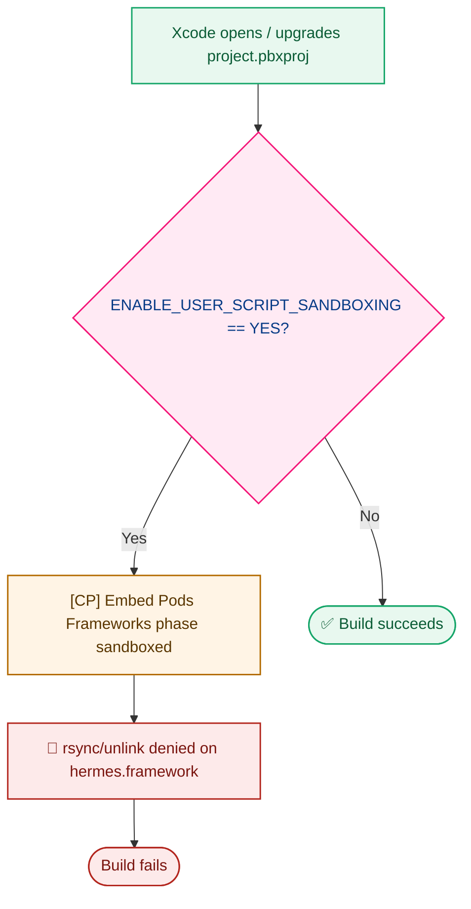

<p align="center">
  <h1 align="center">🍎 MyHealthHub — iOS Native Project</h1>
</p>

<p align="center">
  <strong>The Xcode/CocoaPods builder for MyHealthHub on iOS.</strong><br/>
  No JS/TS source lives here — see <a href="../lxc-myhealthhub-shared/">lxc-myhealthhub-shared</a> for that.
</p>

<p align="center">
  
  
  
  <a href="./LICENSE"></a>
</p>

---

## 📚 Table of Contents

- [📖 Overview](#-overview)
- [🕘 History & Status](#-history--status)
- [🩹 Known Gotcha: Build Sandbox](#-known-gotcha-build-sandbox)
- [📂 Where the App Code Lives](#-where-the-app-code-lives)
- [🚀 Building](#-building)

---

## 📖 Overview

This folder is the **iOS builder** for the MyHealthHub app. It contains only
the Xcode project and CocoaPods config — `LxcMyHealthHub.xcodeproj`,
`LxcMyHealthHub.xcworkspace`, `Podfile` — there is no JS/TS source here.

## 🕘 History & Status

This is the `ios/` folder from the original `lxc-myhealthhub-mobile` project,
moved out to a sibling folder on 2026-07-21 so the native iOS build project is
separated from the shared app source. Git history was preserved as a rename.

> **Status (2026-07-23): verified working.** Builds and launches successfully
> on both the iOS Simulator and a physical device via `npx react-native run-ios`.

## 🩹 Known Gotcha: Build Sandbox

Xcode auto-upgrading `project.pbxproj` (e.g. after opening it in a newer
Xcode version) sets `ENABLE_USER_SCRIPT_SANDBOXING = YES`, which breaks
CocoaPods' **"[CP] Embed Pods Frameworks"** build phase with a sandbox
`rsync`/`unlink` denial on `hermes.framework`.

| Symptom | Fix |
|---|---|
| Build fails with `Sandbox: rsync(...) deny(1) file-write* ... hermes.framework` | Set `ENABLE_USER_SCRIPT_SANDBOXING` back to `NO` for **both** Debug and Release in the project's build settings |



`../Executable/macos_iosapp_build.sh` checks for this on every run and
force-flips it back to `NO` before building, so this shouldn't need manual
intervention.

## 📂 Where the App Code Lives

All screens, components, navigation, theme, and API code live in
[`../lxc-myhealthhub-shared`](../lxc-myhealthhub-shared/). This folder just
builds it for iOS — the `Podfile` points at `../lxc-myhealthhub-shared` as
the JS project root and `node_modules` location.

## 🚀 Building

**Fastest path** — one-shot script that loads the toolchain, installs deps,
and builds+launches for you (see
[`../Executable/README.md`](../Executable/README.md) for details):

```bash
../Executable/macos_iosapp_build.sh              # simulator (default: iPhone 14)
../Executable/macos_iosapp_build.sh device        # physical device
```

**Or manually**, from `lxc-myhealthhub-shared` (where `package.json` lives):

```bash
cd ../lxc-myhealthhub-shared
npm run pod:install   # cd's here and runs `pod install`
npm run ios           # build + run on simulator/device
```

You can also open `LxcMyHealthHub.xcworkspace` (**not** the `.xcodeproj`)
directly in Xcode after running `pod install`.

See [`../lxc-myhealthhub-shared/README.md`](../lxc-myhealthhub-shared/README.md)
for prerequisites and full build/run instructions.
