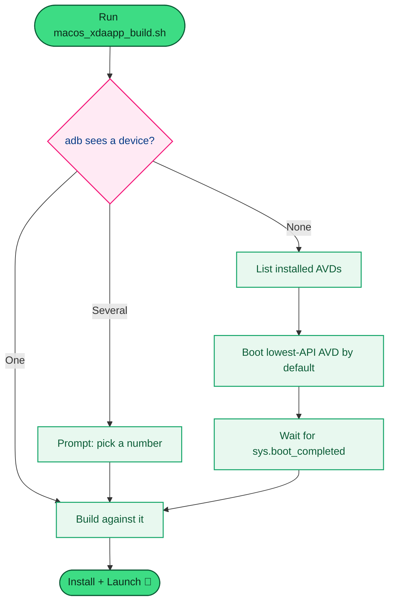

<p align="center">
  <h1 align="center">🤖 MyHealthHub — Android Native Project</h1>
</p>

<p align="center">
  <strong>The Gradle builder for MyHealthHub on Android.</strong><br/>
  No JS/TS source lives here — see <a href="../lxc-myhealthhub-shared/">lxc-myhealthhub-shared</a> for that.
</p>

<p align="center">
  
  
  
  <a href="./LICENSE"></a>
</p>

---

## 📚 Table of Contents

- [📖 Overview](#-overview)
- [🕘 History & Status](#-history--status)
- [🗺️ Device/Emulator Selection](#️-deviceemulator-selection)
- [📂 Where the App Code Lives](#-where-the-app-code-lives)
- [🚀 Building](#-building)
- [📦 APK Output](#-apk-output)

---

## 📖 Overview

This folder is the **Android builder** for the MyHealthHub app. It contains
only the Gradle/native Android project — `app/`, `gradle/`, `build.gradle`,
`settings.gradle` — there is no JS/TS source here.

## 🕘 History & Status

This is the `android/` folder from the original `lxc-myhealthhub-mobile`
project, moved out to a sibling folder on 2026-07-21 so the native Android
build project is separated from the shared app source. Git history was
preserved as a rename.

> **Status (2026-07-23): verified working**, including a full
> auto-booted-emulator run via `../Executable/macos_xdaapp_build.sh`.

## 🗺️ Device/Emulator Selection

`../Executable/macos_xdaapp_build.sh` doesn't just fail when nothing's
plugged in — it lists the installed emulators (AVDs) and boots one for you:



## 📂 Where the App Code Lives

All screens, components, navigation, theme, and API code live in
[`../lxc-myhealthhub-shared`](../lxc-myhealthhub-shared/). This folder just
builds it for Android — `settings.gradle` and `app/build.gradle` point at
`../lxc-myhealthhub-shared/node_modules` and treat that folder as the JS
project root.

## 🚀 Building

**Fastest path** — one-shot script that loads the toolchain, auto-boots an
emulator if nothing's connected, builds, and installs+launches (see
[`../Executable/README.md`](../Executable/README.md) for details):

```bash
../Executable/macos_xdaapp_build.sh
```

**Or manually**, from `lxc-myhealthhub-shared` (where `package.json` lives):

| Command | What it does |
|---|---|
| `npm run android` | Build + run on emulator/device |
| `npm run build:android:debug` | `cd`'s here and runs `./gradlew assembleDebug` |
| `npm run clean:android` | `cd`'s here and runs `./gradlew clean` |

```bash
cd ../lxc-myhealthhub-shared
npm run android
```

You can also open this folder directly in Android Studio.

## 📦 APK Output

> ⚠️ **This project builds per-ABI split APKs, not a single universal APK.**
> There is no `app-debug.apk`.

```text
app/build/outputs/apk/debug/MyHealthHub-debug-arm64-v8a.apk   (and armeabi-v7a / x86 / x86_64)
```

`../Executable/macos_xdaapp_build.sh` picks the right split automatically
based on the target device's ABI (`adb shell getprop ro.product.cpu.abi`).

See [`../lxc-myhealthhub-shared/README.md`](../lxc-myhealthhub-shared/README.md)
for prerequisites, the macOS local toolchain setup, and full build/run
instructions.
